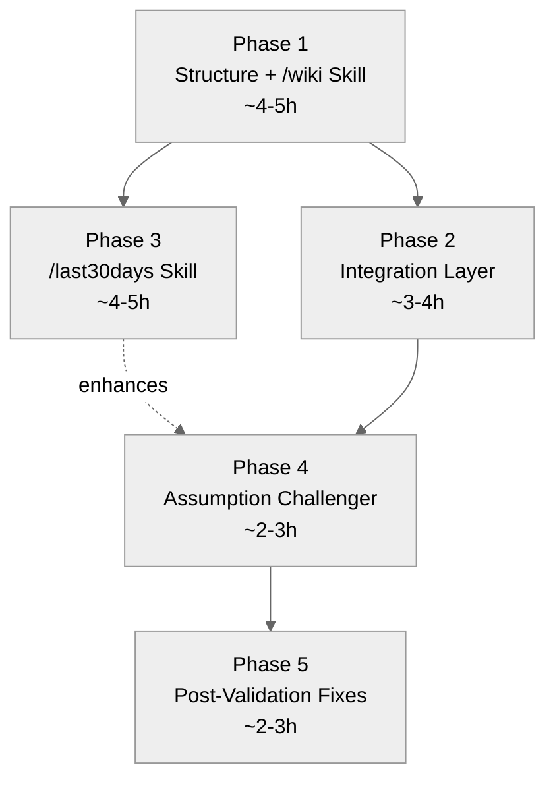

# Product Memory Wiki — Implementation Plan for Cadence OS

A 5-phase plan to add a **knowledge synthesis layer** to Cadence OS. Based on the "llm-wiki" concept (Andrej Karpathy) and "/last30days" pattern (Matt Van Horn), adapted for the Cadence OS architecture.

**Date:** 2026-04-09
**Status:** Phases 1-4 complete · Phase 5 pending (post-validation after 2+ weeks of usage)

---

## Context

**Problem:** Cadence OS generates documents, tracks tasks, and processes meetings — but product knowledge stays trapped in individual artifacts. There's no place where insights compound, hypotheses get challenged, or decisions are traceable over time.

**Solution:** A `wiki/` layer that sits between raw artifacts (`documents/`, `to_do's/`) and strategic context (`global-context/`). Entries are living, gain/lose confidence, and are automatically challenged against new evidence.

**Principle:** The wiki is NOT another document folder. It's a synthesis layer — more refined than meeting notes, more dynamic than global-context. Entries evolve, get promoted, get merged, and decay.

---

## Architecture Fit

Cadence OS operates filesystem-first, convention over configuration. All state is markdown. Skills compose through shared artifacts, not imports.

**Current data flow:**

```
meetings → meeting-notes skill → person pages, commitments
                                      ↓
                              morning briefing reads them
```

**With wiki:**

```
meetings → meeting-notes skill → person pages, commitments
                ↓                        ↓
         wiki candidates          morning briefing reads them
                ↓                        ↓
           wiki entries ←──── morning briefing reads wiki too
                ↓
    /last30days synthesizes → assumption challenger challenges
                                     ↓
                              weekly review reports health
```

The wiki follows the same composition pattern: skills **write** wiki entries → other skills **read** them.

**Conventions this plan follows:**

- Skills live in `.cursor/skills/[name]/SKILL.md`
- Skills are registered in `.cursor/skills/registry.json`
- Trigger phrases go in `.cursor/rules/product-context.mdc` (Natural Language Triggers table)
- New state paths are documented in `ARCHITECTURE.md` (File-Based State table)
- Workspace map in `CLAUDE.md` includes the new folder

---

## Data Model: Wiki Entry

Each entry is a markdown file with YAML frontmatter. This is the atomic unit of the system.

### Frontmatter Schema

```yaml
---
topic: "Payment failure is the #1 churn driver for subscriptions"
id: W-0409-1
domain: subscriptions       # from product-context.mdc Active Domains
type: hypothesis             # decision | hypothesis | learning | signal | pattern
confidence: medium           # high | medium | low | outdated
created: 2026-04-09
last_updated: 2026-04-09
last_challenged: null        # date of last assumption challenge
sources:
  - documents/RESEARCH-INPUT-churn-2026-03.md
  - "MEETING-1on1-Wagner-2026-04-01 (payment recovery discussion)"
tags: [churn, payments, dunning, subscriptions]
related:
  - W-0315-2
  - W-0322-1
---
```

**Domain values** are derived from `product-context.mdc` Active Domains table. If no domains are configured, use `shared` as default. The wiki does not hardcode domain names — it reads them from the product context.

### Entry Types


| Type         | Captures                     | Detection signals                                                  |
| ------------ | ---------------------------- | ------------------------------------------------------------------ |
| `decision`   | "We decided X because Y"     | "decidimos", "ficou combinado", "the call was", "we're going with" |
| `hypothesis` | "We believe X because Y"     | "eu acho que", "my bet is", "we assume", "probably because"        |
| `learning`   | "We validated/invalidated X" | "data shows", "turns out", "we discovered", "confirmamos"          |
| `signal`     | "Competitor/market did X"    | competitor name + action/launch                                    |
| `pattern`    | "X keeps happening in Y"     | "de novo", "sempre que", "pattern", "toda vez"                     |


### Body Structure (after frontmatter)

```markdown
# [Topic — same string as frontmatter]

## Summary

[2-3 sentences. Self-contained — understandable without reading anything else.]

## Evidence Trail

<!-- Chronological, most recent first. Each item with date and source link. -->

- **2026-04-09** — [Source: MEETING-1on1-Wagner-2026-04-01] Wagner mentioned voluntary churn growing faster than involuntary.
- **2026-03-15** — [Source: RESEARCH-INPUT-churn-2026-03.md] Analysis shows 60% of churned merchants had <3 successful charges.

## Assumptions

<!-- What must be true for this entry to hold -->

- Churn data in the data lake is correct and complete
- The definition of "payment failure" is consistent across countries

## Open Questions

- [ ] What's the proportion of voluntary vs involuntary churn by country?
- [ ] Does the pattern hold for Enterprise merchants or only SMBs?

## Changelog

| Date | Change | Confidence before → after |
|------|--------|---------------------------|
| 2026-04-09 | Created from RESEARCH-INPUT-churn | — → medium |
```

### ID Rules

- Format: `W-MMDD-N` (W = wiki, MMDD = month/day of creation, N = sequential within the day)
- Check `wiki/INDEX.md` before creating to avoid duplicates
- IDs are permanent — if invalidated, confidence changes to `outdated` but ID stays

---

## Folder Structure

```
wiki/
├── README.md                    # Usage guide
├── INDEX.md                     # Auto-maintained catalog of all entries
├── _TEMPLATE.md                 # Template for new entries
├── product/                     # Knowledge entries by type
│   ├── decisions/
│   ├── hypotheses/
│   ├── learnings/
│   ├── signals/
│   └── patterns/
├── syntheses/                   # Output from /last30days
└── challenges/                  # Output from assumption challenger
```

---

## Phase 1: Structure + /wiki Skill

**Goal:** Create the wiki infrastructure and the core skill with 5 modes (capture, query, browse, merge, promote).

**Effort:** ~4-5h (1 focused session)

**Dependencies:** None

**User gets:** A functional wiki integrated into the workflow with natural language triggers.

### 1.1 Create Folder Structure

**Why:** The wiki needs a home. All Cadence OS state is file-based — establishing the folder structure first enables all subsequent work. Without this, there's nowhere for entries to live.

**Action:**

- Create `wiki/README.md` — usage guide (entry types, confidence levels, commands, rules)
- Create `wiki/_TEMPLATE.md` — entry template with frontmatter schema and body structure
- Create `wiki/INDEX.md` — auto-maintained catalog (sorted by `last_updated`, with totals and health counts)
- Create folders with `.gitkeep`: `product/decisions/`, `product/hypotheses/`, `product/learnings/`, `product/signals/`, `product/patterns/`, `syntheses/`, `challenges/`

**Effort:** ~30min | **Impact:** High (foundation for everything)

### 1.2 Create /wiki Skill

**Why:** The skill is the core interface — it's how the user (and other skills) interact with the wiki. Without it, the folder is just empty directories.

**File:** `.cursor/skills/wiki/SKILL.md`

The skill has 5 modes, detected from user intent:

**Mode 1: Capture** — Create or update a wiki entry.

Steps:

1. **Classify** the input using detection signals from the Entry Types table. If ambiguous, ask.
2. **Deduplicate** — search `wiki/INDEX.md` and `wiki/product/` for similar topics or matching tags. If found, offer to update instead of creating.
3. **Determine metadata** — domain (from `product-context.mdc` Active Domains), tags (3-5 keywords), sources, related entries, confidence level.
4. **Generate ID** — check `wiki/INDEX.md` for latest ID today, increment N.
5. **Create entry** — read `wiki/_TEMPLATE.md`, fill frontmatter, write summary, first evidence item, assumptions, open questions, changelog.
6. **Update INDEX.md** — add/update row, re-sort by last_updated, recalculate totals and health.
7. **Confirm** to user with ID, type, confidence, domain, tags.
8. **Suggest data validation** (optional) — if type is `hypothesis` or `signal`, check if tags overlap with data domains accessible via `data-excellence-tools` skill. If match, suggest: "This hypothesis can be validated with data. Want to run a query?" Never auto-run.

**Mode 2: Query** — Look up what you know about a topic.

Steps:

1. Search `wiki/INDEX.md` by topic (fuzzy), tags (exact), domain.
2. Grep `wiki/product/` for the search term in file contents.
3. Present results with ID, topic, type, confidence, age, summary excerpt, related entries.
4. Offer actions: view details, create new entry, compare entries.

**Mode 3: Browse** — Wiki health dashboard.

Steps:

1. Read `wiki/INDEX.md`.
2. Generate dashboard: totals by type and domain, stale/low/outdated counts, last 3 additions, entries needing attention.
3. Suggest actions: update stale entries, challenge hypotheses, create entries for frequent meeting topics.

**Mode 4: Merge** — Consolidate overlapping entries.

Steps:

1. Load both entries, present side-by-side comparison (topic, type, confidence, evidence count, tags, last updated).
2. Determine primary entry (more evidence → primary, higher confidence → tiebreaker, more recent → tiebreaker).
3. Merge into primary: combine evidence trails (interleave by date, deduplicate), union tags and related entries, recalculate confidence (1-2 sources → low, 3-4 → medium, 5+ → high), consolidate assumptions and open questions, add changelog entry.
4. Mark absorbed entry: confidence → `outdated`, prepend "Merged into [primary-ID]" to summary, add changelog.
5. Update INDEX.md.
6. Confirm with summary of changes.

**Mode 5: Promote** — Graduate entry to a different type based on accumulated evidence.

Graduation criteria:


| From         | To         | Criteria                                                      |
| ------------ | ---------- | ------------------------------------------------------------- |
| `hypothesis` | `learning` | 3+ evidence items from distinct sources AND confidence = high |
| `hypothesis` | `outdated` | Contradicting evidence OR >90 days without new evidence       |
| `signal`     | `pattern`  | Same signal observed 3+ times in distinct sources             |
| `pattern`    | `learning` | Pattern confirmed by quantitative data                        |


Steps:

1. Read entry, count evidence items and distinct sources, check confidence and age.
2. Present assessment: criteria met → offer promotion. Criteria not met → show what's missing and suggest where to find evidence.
3. If confirmed: move file to new type folder, update frontmatter type, add changelog, update INDEX.md.

**Error handling:**

- INDEX.md out of sync → rebuild from files, warn user.
- Duplicate ID → increment N until unique, warn user.

**Quality checklist** (enforced before finalizing any operation):

- Frontmatter complete (all fields filled)
- Summary is self-contained
- Evidence Trail has at least 1 item with date and source
- ID is unique (verified against INDEX.md)
- INDEX.md updated
- Tags are lowercase, no spaces
- Related entries exist if listed
- File saved to correct path: `wiki/product/[type-plural]/`

**Effort:** ~2-3h | **Impact:** Very high (core interface)

### 1.3 Update Registry

**Why:** Skills must be registered to be discoverable. Without this, the wiki skill won't appear in the skills list and won't match triggers.

**File:** `.cursor/skills/registry.json`

**Action:**

- Add wiki entry to the `skills` array:

```json
{
  "id": "wiki",
  "name": "Product Memory Wiki",
  "category": "knowledge",
  "triggers": ["wiki", "add to wiki", "wiki lookup", "what do I know about", "wiki status", "wiki health", "update wiki", "wiki merge", "wiki promote", "graduar wiki"],
  "inputs": [
    "wiki/**/*.md",
    "documents/**/*.md",
    "context/people/*.md",
    "to_do's/commitments.md"
  ],
  "outputs": [
    "wiki/product/**/*.md",
    "wiki/INDEX.md"
  ],
  "integrations": ["data-excellence-tools"],
  "estimated_time": "1-3 min",
  "depends_on": []
}
```

**Effort:** ~10min | **Impact:** High (discoverability)

### 1.4 Update Natural Language Triggers

**Why:** The trigger table in `product-context.mdc` is how the session protocol routes user intent to skills. Without these entries, the user has to know the exact skill name.

**File:** `.cursor/rules/product-context.mdc`

**Action:**

- Add to the Natural Language Triggers table:

```markdown
| Wiki Capture | "wiki:", "add to wiki", "save to wiki", "anotar no wiki" | Execute wiki skill (capture mode) |
| Wiki Query | "what do I know about", "wiki lookup", "o que sei sobre" | Execute wiki skill (query mode) |
| Wiki Browse | "wiki status", "wiki health", "stale entries", "saúde do wiki" | Execute wiki skill (browse mode) |
| Wiki Merge | "wiki merge", "fundir wiki entries", "merge wiki" | Execute wiki skill (merge mode) |
| Wiki Promote | "wiki promote", "graduar wiki", "graduate entry" | Execute wiki skill (promote mode) |
```

**Effort:** ~10min | **Impact:** High (natural language access)

### 1.5 Update CLAUDE.md

**Why:** `CLAUDE.md` is the workspace map — editors that don't load `.mdc` files use it as context. If the wiki folder isn't listed, AI assistants won't know it exists.

**File:** `CLAUDE.md`

**Action:**

- Add to Workspace Map after `frameworks/`:

```
├── wiki/                    # Product Memory Wiki (knowledge base)
│   ├── INDEX.md             # Auto-maintained catalog of entries
│   ├── product/             # Entries by type (decisions, hypotheses, learnings, signals, patterns)
│   ├── syntheses/           # Output from /last30days skill
│   └── challenges/          # Output from assumption challenger
```

**Effort:** ~5min | **Impact:** Medium (editor compatibility)

### 1.6 Update ARCHITECTURE.md

**Why:** The architecture doc maps all file-based state and data flows. The wiki adds new state paths that other contributors (and the AI) need to know about.

**File:** `ARCHITECTURE.md`

**Action:**

- Add to File-Based State table:

```markdown
| `wiki/INDEX.md` | Wiki entry catalog (IDs `W-MMDD-N`) | Wiki skill |
| `wiki/product/**/*.md` | Knowledge entries (decisions, hypotheses, learnings, signals, patterns) | Wiki skill, conversational capture |
| `wiki/syntheses/*.md` | Monthly knowledge syntheses | Last30days skill |
| `wiki/challenges/*.md` | Assumption challenge reports | Assumption challenger |
```

- Add to Data Flow section:

```
Skills / Templates (multi-step workflows with explicit file I/O)
    │
    ├── Write: documents/*.md, to_do's/*.md, wiki/**/*.md
```

- Add to Composition pattern section:

```
- Meeting notes / daily review / conversational capture **write** wiki entries → Assumption challenger **reads** and challenges
- Wiki entries **inform** morning briefing (Wiki Pulse) and weekly review (Knowledge Health)
```

**Effort:** ~15min | **Impact:** Medium (system documentation)

### Phase 1 Test Plan


| Test                | Command / Input                                    | Expected Result                                                 |
| ------------------- | -------------------------------------------------- | --------------------------------------------------------------- |
| Capture             | "wiki: payment failures are the main churn driver" | Creates `wiki/product/hypotheses/W-MMDD-N.md`, updates INDEX.md |
| Duplicate detection | Same capture again                                 | Offers to update existing entry instead of creating new         |
| Query               | "what do I know about churn"                       | Returns the entry with summary, confidence, age                 |
| Browse              | "wiki health"                                      | Dashboard with totals, types, stale counts                      |
| Merge               | "wiki merge W-0409-1 W-0409-2"                     | Absorbed entry → outdated, primary updated                      |
| Promote             | "wiki promote W-0409-1" (with 3+ evidence)         | Graduates hypothesis → learning, moves file                     |
| INDEX sync          | Delete entry, run "wiki health"                    | Detects out-of-sync, rebuilds INDEX                             |


### Phase 1 Checklist

- 1.1 — Create `wiki/` folder structure (README, _TEMPLATE, INDEX, subfolders)
- 1.2 — Create `.cursor/skills/wiki/SKILL.md` with all 5 modes
- 1.3 — Add wiki to `registry.json`
- 1.4 — Add triggers to `product-context.mdc`
- 1.5 — Update workspace map in `CLAUDE.md`
- 1.6 — Update File-Based State in `ARCHITECTURE.md`
- Run test plan (all 7 tests)

---

## Phase 2: Integration Layer

**Goal:** Wire the wiki into existing skills so it feeds naturally from daily workflow — without needing explicit "wiki:" commands.

**Effort:** ~3-4h (targeted edits in 6 existing files)

**Dependencies:** Phase 1

**User gets:** Wiki that populates itself from meetings, conversations, documents, and reviews.

### 2.1 Conversational Capture — Add Wiki Routing

**Why:** Conversational capture is the primary "loose input" router. Without wiki routing, the user must explicitly say "wiki:" — most insights are shared naturally as observations. This is the highest-leverage integration because it captures knowledge passively.

**File:** `.cursor/rules/conversational-capture.mdc`

**Action:**

Edit 1 — In the Step 2 table ("Classify the Input"), add 3 new rows:

```markdown
| **Product insight** | "I learned", "turns out", "data shows", "we discovered", "confirmamos" | `wiki/product/learnings/` via wiki skill (capture) |
| **Product hypothesis** | "I think", "my bet is", "we assume", "probably because", "eu acho que" | `wiki/product/hypotheses/` via wiki skill (capture) |
| **Product decision** | "decidimos", "ficou combinado", "the call was", "we're going with" | `wiki/product/decisions/` via wiki skill (capture) |
```

Edit 2 — In the "Integration with Other Workflows" section, add:

```markdown
- If the input is a product insight, hypothesis, or decision, route to the wiki skill in capture mode. The skill handles classification, deduplication, and indexing.
```

**Routing priority rule:** If the input matches both an existing type (e.g., "Decision record" → initiative/meeting doc) and a wiki type (e.g., "Product decision"), wiki routing takes **priority** over `documents/`. The wiki is the preferred destination for distilled knowledge; `documents/` is for formal artifacts (PRDs, specs).

**Effort:** ~30min | **Impact:** Very high (passive capture)

### 2.2 Meeting Notes — Suggest Wiki Candidates

**Why:** Meetings are the #1 source of product decisions, hypotheses, and learnings. If the meeting-notes skill doesn't surface wiki candidates, users must manually re-enter what they discussed — defeating the purpose.

**File:** `.cursor/skills/meeting-notes/SKILL.md`

**Action:**

- Add a new Step 9 after the current Step 8 ("Suggest Follow-ups"):

```markdown
### Step 9: Suggest Wiki Entries

After processing the meeting, scan the output for wiki candidates:

1. **Decisions made** → Suggest as `decision` wiki entries
2. **Key learnings or data points** → Suggest as `learning` wiki entries
3. **Hypotheses discussed** → Suggest as `hypothesis` wiki entries

For each candidate, present:

**Wiki candidates detected:**
1. Decision: "[text]" → type: decision (confidence: high)
2. Hypothesis: "[text]" → type: hypothesis (confidence: medium)

Add to wiki? (all / select / skip)

**Rules:**
- Max 3 candidates per meeting (prioritize decisions > learnings > hypotheses)
- If user says "all", create all entries via wiki skill capture mode
- If user says "skip", move on immediately
- Do NOT block the meeting notes flow — this is a suggestion
```

- Update Quality Checklist — add: `- [ ] Wiki candidates suggested (decisions, learnings, hypotheses from meeting)`

**Effort:** ~30min | **Impact:** High (meeting → knowledge pipeline)

### 2.3 Session Protocol — Wiki Freshness

**Why:** The session protocol already alerts on stale tasks and commitments. Adding wiki freshness keeps the knowledge base healthy without requiring the user to remember to check it.

**File:** `.cursor/rules/session-protocol.mdc`

**Action:**

Edit 1 — In Phase 3 ("Staleness Checks"), add item 5:

```markdown
5. **Wiki freshness** — If `wiki/INDEX.md` exists, check:
   - Entries with confidence `low` or `outdated` for >7 days → flag
   - If latest synthesis (`wiki/syntheses/`) is >30 days old → suggest /last30days
   - Maximum 1 wiki alert per session (don't compete with task/commitment alerts)
```

Edit 2 — In the alert format example, add:

```markdown
- Wiki: 3 hypotheses with "low" confidence for >7 days — run "wiki health"?
```

**Effort:** ~15min | **Impact:** Medium (automated health checks)

### 2.4 Morning Briefing — Wiki Pulse

**Why:** The morning briefing is the daily "status page." If wiki entries relevant to today's meetings or priorities exist, surfacing them helps the user prepare with institutional memory — not just calendar awareness.

**File:** `.cursor/skills/morning-briefing/SKILL.md`

**Action:**

Edit 1 — In Step 2 ("Load Planning Context"), add:

```
Read: @wiki/INDEX.md (if exists — for Wiki Pulse section)
```

Edit 2 — In Step 8 ("Generate Briefing"), add a new section after "Initiative Pipeline" and before "Immediate Attention":

```markdown
## Wiki Pulse

[Only include if wiki/INDEX.md exists and has entries. Omit entirely otherwise.]

Read `wiki/INDEX.md` and compute:
- Total entries count
- Entries updated in the last 7 days
- Entries with confidence "low" or "outdated"
- Hypotheses never challenged (last_challenged is null)

Format:

**Wiki Pulse:** X entries | Y updated this week | Z stale hypotheses (>30 days) | W never challenged

[If any entries are stale and relate to today's meetings or week priorities, mention specifically:]
- "[W-XXXX-X] relates to today's meeting with [Person] — consider reviewing before the call"
```

**Effort:** ~30min | **Impact:** Medium (context-aware briefings)

### 2.5 Daily Review — Wiki Check

**Why:** End-of-day is when learnings crystalize. Prompting the user to capture them while context is fresh prevents knowledge loss overnight.

**File:** `.cursor/skills/daily-review/SKILL.md`

**Action:**

- Add a new Step 6b between Step 6 ("Update Learnings") and Step 7 ("Commitment Review"):

```markdown
### Step 6b: Suggest Wiki Updates

If the user worked on documents, had meetings, or shared insights during the day:

1. Check if any completed tasks or learnings relate to existing wiki entries
2. Check if any new knowledge emerged that doesn't have a wiki entry yet

**Wiki check:**
- [If relevant] Entry [W-XXXX-X] can be updated with today's learning about [topic]
- [If relevant] New insight: "[observation]" — create wiki entry? (type: learning)

Update / Create / Skip?

**Rules:**
- Max 2 suggestions (keep the review fast)
- If user says "skip", move on immediately
- If no wiki-relevant work happened today, omit this step entirely
```

**Effort:** ~20min | **Impact:** Medium (end-of-day capture)

### 2.6 Post-Document Protocol — Wiki Check

**Why:** Documents like PRDs, One-Pagers, and RICE analyses contain implicit decisions and hypotheses. If these aren't captured in the wiki, they stay buried in long documents where no one will re-read them.

**File:** `.cursor/rules/cadence-workflows.mdc`

**Action:**

- In the "Post-Document Generation Protocol" section, add a new item 4 between item 3 ("Commitments") and item 4 ("Next Step"). Renumber the current item 4 to item 5:

```markdown
### 4. Wiki Check (if applicable)
If the document contains decisions, learnings, or product hypotheses:
- Check if related wiki entries exist in `wiki/INDEX.md`
- If yes, suggest updating with new evidence
- If no, suggest creating a new entry
- Format: "Wiki candidate: [topic] (type: [type]). Add?"
- Do not block — this is a suggestion

### 5. Next Step (via cadence-coach Protocol 1)
Suggest next step per the capability map
```

**Effort:** ~15min | **Impact:** Medium (document → knowledge pipeline)

### What stays manual (and should)


| Aspect                     | Reason                                                                 |
| -------------------------- | ---------------------------------------------------------------------- |
| Confidence level judgment  | Requires PM interpretation — automated scoring would be overly rigid   |
| Merge decisions            | Side-by-side comparison needs human judgment on which entry is primary |
| Promotion approval         | Graduation criteria are met, but the PM decides if it's meaningful     |
| Wiki entry writing quality | Summaries need to be self-contained — AI generates, PM approves        |


### Phase 2 Test Plan


| Test                   | Trigger                                                | Expected Result                                 |
| ---------------------- | ------------------------------------------------------ | ----------------------------------------------- |
| Conversational capture | "turns out payment recovery improves retention by 20%" | Routed to wiki as `learning`, not to documents/ |
| Meeting notes          | Process a meeting with decisions                       | Step 9 suggests wiki candidates (max 3)         |
| Session protocol       | Start session with 3+ stale hypotheses                 | Alert: "Wiki: 3 hypotheses with low confidence" |
| Morning briefing       | Run briefing with wiki entries                         | Wiki Pulse section appears with counts          |
| Daily review           | End day after meeting-heavy day                        | Step 6b suggests wiki updates (max 2)           |
| Post-document          | Generate a PRD with decisions                          | Wiki Check suggests entries                     |


### Phase 2 Checklist

- 2.1 — Add wiki routing types to `conversational-capture.mdc` (Step 2 table + Integration section)
- 2.2 — Add Step 9 (Wiki candidates) to `meeting-notes/SKILL.md`
- 2.3 — Add wiki freshness check (item 5) to `session-protocol.mdc` Phase 3
- 2.4 — Add Wiki Pulse to `morning-briefing/SKILL.md` (Step 2 + Step 8)
- 2.5 — Add Step 6b (Wiki check) to `daily-review/SKILL.md`
- 2.6 — Add item 4 (Wiki Check) to `cadence-workflows.mdc` Post-Document Protocol
- Run test plan (all 6 tests)

---

## Phase 3: /last30days Skill

**Goal:** Generate a periodic synthesis of all PM activity, surfacing themes, decisions, knowledge gaps, and assumption drift.

**Effort:** ~4-5h (heavy read skill across multiple sources)

**Dependencies:** Phase 1

**User gets:** Monthly synthesis showing dominant themes, decisions made, gaps in knowledge, and temporal comparison.

### 3.1 Create /last30days Skill

**Why:** Individual wiki entries are atoms — useful but disconnected. The synthesis is what makes knowledge compound: themes emerge, gaps become visible, attention patterns reveal blind spots. Without synthesis, the wiki is a note-taking tool; with it, it's a strategic memory system.

**File:** `.cursor/skills/last30days/SKILL.md`

**Trigger commands:** "last 30 days", "monthly synthesis", "knowledge synthesis", "últimos 30 dias", "síntese mensal", "what happened this month"

**Steps:**

1. **Determine date range** — default: last 30 calendar days. Accept custom ranges ("last 2 months", "March").
2. **Load data sources** (parallel where possible):


| Group           | Source                | Path                                                              |
| --------------- | --------------------- | ----------------------------------------------------------------- |
| A — Daily       | Briefings             | `to_do's/briefings/*.md` (in range)                               |
| A — Daily       | Reviews               | `to_do's/reviews/*.md` (in range)                                 |
| B — Weekly      | Weekly reviews        | `to_do's/weekly-reviews/*.md` (overlapping)                       |
| C — Meetings    | Meeting notes         | `documents/**/MEETING-*.md` (via git log, in range)               |
| D — Documents   | Created/modified docs | `documents/**/*.md` (via git log, in range)                       |
| E — Operational | Tasks, commitments    | `to_do's/tasks.md`, `to_do's/commitments.md`                      |
| F — Wiki        | Wiki entries          | `wiki/INDEX.md`, entries updated in range                         |
| G — Learnings   | Patterns, usage       | `to_do's/learnings/patterns.md`, `to_do's/learnings/usage-log.md` |


**Performance guard:** If any group has >30 files, sample the 20 most recent.

1. **Analyze and cross-reference:**
  - **Theme extraction:** Topics by frequency across all sources
  - **Decision inventory:** All decisions with date, who, topic
  - **Knowledge assessment:** Wiki entries referenced/relevant in the period, evidence changes
  - **Gap detection:** Topics in meetings/tasks with no wiki entry
  - **People map:** Who appeared most, open commitments per person
  - **Attention distribution:** Artifacts per domain (from product-context.mdc Active Domains)
2. **Generate synthesis** — save to `wiki/syntheses/SYNTHESIS-YYYY-MM-DD.md` with frontmatter (period, sources count) and sections: Dominant Themes, Decisions Made, Knowledge Gained, Knowledge Gaps, Assumption Drift, People Map, Attention Distribution, Suggested Wiki Updates.
3. **Temporal comparison** (if requested) — add a Delta section: topics gained/lost attention, confidence changes, decisions that evolved.
4. **Suggest wiki updates** — present candidates for user confirmation. Never auto-create.

**Error handling:**

- <5 sources → generate what's possible, note data limitation
- No wiki entries yet → skip Knowledge Gained/Assumption Drift sections, suggest using synthesis as starting point
- Git unavailable → infer dates from filenames and frontmatter

**Effort:** ~3-4h | **Impact:** Very high (compound knowledge)

### 3.2 Update Registry

**Why:** Same as Phase 1.3 — discoverability.

**File:** `.cursor/skills/registry.json`

**Action:**

- Add to the `skills` array:

```json
{
  "id": "last30days",
  "name": "30-Day Knowledge Synthesis",
  "category": "knowledge",
  "triggers": ["last 30 days", "monthly synthesis", "knowledge synthesis", "últimos 30 dias", "síntese mensal"],
  "inputs": [
    "to_do's/briefings/*",
    "to_do's/reviews/*",
    "to_do's/weekly-reviews/*",
    "documents/**/MEETING-*.md",
    "documents/**/*.md",
    "to_do's/tasks.md",
    "to_do's/commitments.md",
    "wiki/**/*.md",
    "to_do's/learnings/patterns.md"
  ],
  "outputs": [
    "wiki/syntheses/SYNTHESIS-YYYY-MM-DD.md"
  ],
  "integrations": [],
  "estimated_time": "5-10 min",
  "depends_on": ["wiki"]
}
```

**Effort:** ~10min | **Impact:** High

### 3.3 Update Natural Language Triggers

**File:** `.cursor/rules/product-context.mdc`

**Action:**

- Add:

```markdown
| Knowledge Synthesis | "last 30 days", "monthly synthesis", "últimos 30 dias", "síntese mensal", "what happened this month" | Execute last30days skill |
```

**Effort:** ~5min | **Impact:** Medium

### Phase 3 Test Plan


| Test                | Input                               | Expected Result                                                    |
| ------------------- | ----------------------------------- | ------------------------------------------------------------------ |
| Basic synthesis     | "últimos 30 dias" (with 5+ sources) | Creates `wiki/syntheses/SYNTHESIS-YYYY-MM-DD.md` with all sections |
| Custom range        | "last 2 months"                     | Synthesis covers 60 days                                           |
| Gap detection       | Topics in meetings but not in wiki  | "Knowledge Gaps" section lists them                                |
| Low source count    | <5 sources available                | Generates partial synthesis, notes limitation                      |
| No wiki entries     | Empty wiki                          | Skips Knowledge Gained, suggests seeding wiki                      |
| Temporal comparison | "compare with last month"           | Delta section shows attention shifts                               |


### Phase 3 Checklist

- 3.1 — Create `.cursor/skills/last30days/SKILL.md`
- 3.2 — Add last30days to `registry.json`
- 3.3 — Add triggers to `product-context.mdc`
- Run test plan (all 6 tests)

---

## Phase 4: Assumption Challenger

**Goal:** An automated weekly job that cross-references recent activity against wiki hypotheses, flags contradictions, tracks temporal decay, and identifies graduation candidates.

**Effort:** ~2-3h (automation template + weekly review edit)

**Dependencies:** Phase 1 + Phase 2. Enhanced by Phase 3 (synthesis data) but functional without it.

**User gets:** Automatic assumption challenge every Friday, feeding the weekly review.

### 4.1 Create Automation

**Why:** Hypotheses decay in the dark. Without active challenging, a "medium confidence" entry from 3 months ago still looks authoritative. The assumption challenger is the immune system of the wiki — it prevents stale beliefs from guiding strategy.

**File:** `.cursor/automations/assumption-challenger.md`

This is a Cursor Automation — instructions to paste into the Cursor Automation agent at cursor.com/automations. Trigger: Cron Schedule, every Friday at 16:00 local time.

**The automation:**

1. **Load wiki hypotheses** — read `wiki/INDEX.md`, filter entries where `type = hypothesis` OR `confidence != high`. If <3 entries, generate minimal report and stop.
2. **Load recent evidence (last 7 days)** — read briefings, reviews, meeting notes, recently modified documents, resolved commitments, wiki entries updated this week.
3. **Cross-reference** each hypothesis against recent evidence:
  - **Supporting evidence** → recommend confidence upgrade
  - **Contradicting evidence** → flag with source, recommend downgrade or outdated
  - **No evidence but relevant to current focus** → flag as "unexamined"
  - **Temporal decay check:**
    - `last_updated` >60 days, confidence != outdated → flag for auto-decay
    - `last_updated` >30 days, confidence = high → flag as "stale high-confidence" (dangerous: appears authoritative but may be wrong)
    - `last_updated` >30 days, confidence = medium → flag as "aging medium"
  - **Graduation check:**
    - hypothesis with 3+ evidence from distinct sources AND confidence high → "Ready to graduate to learning"
    - signal observed 3+ times → "Ready to graduate to pattern"
    - pattern confirmed by quantitative data → "Ready to graduate to learning"
4. **Generate challenge report** — save to `wiki/challenges/CHALLENGE-YYYY-WXX.md` with sections: TL;DR, Contradictions Found, Confirmations, Unexamined, Auto-Decay Flags, Graduation Candidates, Entries Not Challenged.
5. **Update wiki entries** — add evidence trail items and update `last_challenged` date. Do NOT change confidence automatically — flag as recommendations for user to confirm.
6. **Notify via Slack** (if available) — send DM summary with counts and top contradiction. If Slack unavailable, save report only — session protocol will surface it next session.

**What stays manual (and should):**


| Aspect               | Reason                                                   |
| -------------------- | -------------------------------------------------------- |
| Confidence changes   | Recommendations only — user confirms upgrades/downgrades |
| Entry deletion       | Entries are never deleted, only marked outdated          |
| Graduation execution | Challenger flags candidates, user confirms promotion     |


**Effort:** ~1.5-2h | **Impact:** High (automated knowledge hygiene)

### 4.2 Weekly Review — Knowledge Health

**Why:** The weekly review is the PM's checkpoint. Knowledge Health shows whether the wiki is healthy or rotting — just like task staleness shows operational health.

**File:** `.cursor/skills/weekly-review/SKILL.md`

**Action:**

Edit 1 — In Step 3 ("Analyze the Week"), add item 6:

```markdown
6. **Knowledge Health:** If `wiki/` exists:
   - Read latest `wiki/challenges/CHALLENGE-YYYY-WXX.md` (if exists for this week)
   - Count: total wiki entries, entries updated this week, stale entries, contradictions found
   - Extract: top contradiction and top confirmation
```

Edit 2 — In Step 5 ("Generate Weekly Review File"), add a new section after "Learnings da Semana" and before "Prioridades para Próxima Semana":

```markdown
## Knowledge Health

[Only include if wiki/ exists]

- **Wiki entries total:** X (Y updated this week)
- **Challenge report:** [If exists] X entries challenged, Y contradictions, Z confirmations
- **Top contradiction:** [W-XXXX-X] "[topic]" — [1-line summary]
- **Stale entries (>30 days):** X
- **Graduation candidates:** Y entries ready to promote
- **Suggestion:** [Specific action — e.g., "Review contradictions before Monday planning"]
```

**Effort:** ~30min | **Impact:** Medium (weekly visibility)

### Phase 4 Test Plan


| Test                  | Scenario                                       | Expected Result                                |
| --------------------- | ---------------------------------------------- | ---------------------------------------------- |
| Basic challenge       | 3+ hypotheses exist, new evidence this week    | Report with contradictions/confirmations       |
| Temporal decay        | Entry >60 days without update                  | Flagged for auto-decay                         |
| Stale high-confidence | Entry >30 days, confidence = high              | Flagged as "stale high-confidence (dangerous)" |
| Graduation candidate  | Hypothesis with 3+ evidence, high confidence   | Flagged as "Ready to graduate to learning"     |
| Minimal wiki          | <3 entries                                     | Minimal report, no crash                       |
| Weekly review         | Knowledge Health section with challenge report | Displays counts, top contradiction, suggestion |


### Phase 4 Checklist

- 4.1 — Create `.cursor/automations/` folder and `.cursor/automations/assumption-challenger.md`
- 4.2 — Add Knowledge Health to `weekly-review/SKILL.md` (Step 3 item 6 + Step 5 section)
- Run test plan (all 6 tests)

---

## Phase 5: Post-Validation Fixes

**Goal:** Catch inconsistencies, bugs, and gaps that only emerge after real usage of the wiki (Phases 1-4).

**Timing:** Run after 2+ weeks of active wiki usage.

**Why a separate phase?** Experience from the Reports Hub improvement plan showed that a post-validation pass catches 10+ issues that are invisible during design. Testing in isolation misses integration edge cases.

### Anticipated validation areas


| Area                           | What to check                                                                        | Severity |
| ------------------------------ | ------------------------------------------------------------------------------------ | -------- |
| INDEX.md sync                  | Does INDEX stay in sync after rapid create/merge/promote cycles?                     | [HIGH]   |
| Deduplication quality          | Does "similar topic" detection catch near-duplicates without false positives?        | [HIGH]   |
| Conversational capture routing | Do wiki types correctly take priority over `documents/` routing?                     | [HIGH]   |
| Meeting notes Step 9           | Do wiki candidates appear without blocking the flow? Does "skip" work cleanly?       | [MEDIUM] |
| Morning briefing Wiki Pulse    | Does the section omit correctly when wiki is empty? Is it concise enough?            | [MEDIUM] |
| Evidence Trail formatting      | Are dates/sources consistently formatted across entries created by different skills? | [MEDIUM] |
| Tag normalization              | Are tags consistently lowercase, no spaces, across all creation paths?               | [LOW]    |
| Performance on large wikis     | Does "wiki health" stay fast with 50+ entries? Does last30days sample correctly?     | [LOW]    |
| Merge changelog                | After merge, do both entries have correct changelog entries?                         | [LOW]    |


**Action:**

- After 2 weeks of usage, run a systematic audit using the table above
- Create specific fix items per issue found (format: severity tag + problem + action)
- Prioritize by severity: HIGH → fix immediately, MEDIUM → fix in batch, LOW → backlog

**Effort:** ~2-3h (audit + fixes) | **Impact:** High (quality gate before declaring the wiki stable)

---

## Phase Dependencies




**Recommended sequence:** 1 → 2 → 3 → 4 → 5

Phase 2 comes right after Phase 1 so the wiki starts feeding naturally from daily workflow. Phases 3 and 4 make the system progressively more intelligent with monthly syntheses and automatic assumption challenging. Phase 5 is a quality gate after real usage.

---

## Prioritization Summary


| Phase | Item                                 | Effort  | Impact    | When                             |
| ----- | ------------------------------------ | ------- | --------- | -------------------------------- |
| 1     | 1.1 Folder structure                 | ~30min  | High      | Immediate                        |
| 1     | 1.2 /wiki skill (5 modes)            | ~2-3h   | Very high | Immediate                        |
| 1     | 1.3 Registry update                  | ~10min  | High      | Immediate                        |
| 1     | 1.4 Natural language triggers        | ~10min  | High      | Immediate                        |
| 1     | 1.5 CLAUDE.md update                 | ~5min   | Medium    | Immediate                        |
| 1     | 1.6 ARCHITECTURE.md update           | ~15min  | Medium    | Immediate                        |
| 2     | 2.1 Conversational capture routing   | ~30min  | Very high | After Phase 1                    |
| 2     | 2.2 Meeting notes wiki candidates    | ~30min  | High      | After Phase 1                    |
| 2     | 2.3 Session protocol wiki freshness  | ~15min  | Medium    | After Phase 1                    |
| 2     | 2.4 Morning briefing Wiki Pulse      | ~30min  | Medium    | After Phase 1                    |
| 2     | 2.5 Daily review wiki check          | ~20min  | Medium    | After Phase 1                    |
| 2     | 2.6 Post-document wiki check         | ~15min  | Medium    | After Phase 1                    |
| 3     | 3.1 /last30days skill                | ~3-4h   | Very high | After Phase 1                    |
| 3     | 3.2 Registry update                  | ~10min  | High      | With 3.1                         |
| 3     | 3.3 Triggers                         | ~5min   | Medium    | With 3.1                         |
| 4     | 4.1 Assumption challenger automation | ~1.5-2h | High      | After Phase 2 (Phase 3 enhances) |
| 4     | 4.2 Weekly review Knowledge Health   | ~30min  | Medium    | With 4.1                         |
| 5     | Post-validation audit + fixes        | ~2-3h   | High      | After 2 weeks of usage           |


**Total estimated effort:** ~16-20h across all phases

---

## Webapp Consideration

Cadence OS has a webapp layer (`webapp/`) that reads the same markdown files. After implementing the wiki, the webapp's `WorkspaceService` can be extended to:

1. **Read `wiki/INDEX.md`** and display a Wiki tab in the dashboard
2. **Show wiki health** alongside existing task/commitment/initiative views
3. **Link wiki entries** from initiative and meeting pages

This is NOT part of the 5 phases above — it's an optional enhancement after the wiki has content. The wiki is fully functional without the webapp because it operates through the AI skill layer.

---

## Open Decisions

1. **Wiki entry language?** Entries in the language they were captured (mixed PT/EN/ES) or normalize to one language? Suggestion: capture in the user's language, don't force translation — consistency matters less than speed of capture.
2. **Confidence auto-decay?** Should the assumption challenger auto-downgrade confidence after 60 days, or always flag as recommendations? Current plan: recommendations only (user confirms). If this creates friction (too many "confirm decay" prompts), revisit and add auto-decay for entries with `low` confidence only.
3. **INDEX.md as single file vs. per-domain indexes?** Current plan uses a single `wiki/INDEX.md`. If the wiki grows beyond ~100 entries, consider splitting into `wiki/INDEX-{domain}.md`. Watch during Phase 5 post-validation.
4. **Synthesis frequency?** Current plan: on-demand via "/last30days". Should there be an automated monthly synthesis (Cursor Automation on the 1st of each month)? Decision: start manual, automate if the user runs it 3+ consecutive months.
5. **Data validation integration depth?** Phase 1 (Mode 1, step 8) suggests data queries for hypotheses. Should this also run during assumption challenging (Phase 4)? Suggestion: start without it in Phase 4 to keep the automation simple, add data cross-referencing as a Phase 5 enhancement if valuable.

---

## Files Modified by This Plan


| File                                                 | Phase | Change                                                  |
| ---------------------------------------------------- | ----- | ------------------------------------------------------- |
| `wiki/` (new folder)                                 | 1     | Create entire structure                                 |
| `.cursor/skills/wiki/SKILL.md` (new)                 | 1     | Create skill                                            |
| `.cursor/skills/registry.json`                       | 1, 3  | Add wiki and last30days entries                         |
| `.cursor/rules/product-context.mdc`                  | 1, 3  | Add trigger phrases                                     |
| `CLAUDE.md`                                          | 1     | Update workspace map                                    |
| `ARCHITECTURE.md`                                    | 1     | Update File-Based State, Data Flow, Composition pattern |
| `.cursor/rules/conversational-capture.mdc`           | 2     | Add wiki routing types                                  |
| `.cursor/skills/meeting-notes/SKILL.md`              | 2     | Add Step 9 (wiki candidates)                            |
| `.cursor/rules/session-protocol.mdc`                 | 2     | Add wiki freshness check                                |
| `.cursor/skills/morning-briefing/SKILL.md`           | 2     | Add Wiki Pulse                                          |
| `.cursor/skills/daily-review/SKILL.md`               | 2     | Add Step 6b (wiki check)                                |
| `.cursor/rules/cadence-workflows.mdc`                | 2     | Add wiki check to post-doc protocol                     |
| `.cursor/skills/last30days/SKILL.md` (new)           | 3     | Create skill                                            |
| `.cursor/automations/assumption-challenger.md` (new) | 4     | Create automation                                       |
| `.cursor/skills/weekly-review/SKILL.md`              | 4     | Add Knowledge Health                                    |


**Total:** 4 new files/folders, 11 existing file edits.

---

*Plan created: 2026-04-09*
*Refined: 2026-04-09 — structure adapted from Reports Hub IMPROVEMENT-PLAN patterns*
*Adapted for: Cadence OS v1.1.0*
*Based on: Andrej Karpathy "llm-wiki" concept + Matt Van Horn "/last30days" skill*